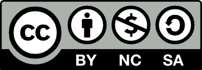

# 엔트리-아두이노

본 서적은 엔트리에 대한 기본 지식은 있으나, 아직 아두이노 C++코딩에는 입문하지 못한,  **엔트리 블록코딩을 통해 아두이노 기본을 익히고자 하는 분/교육하고자 하는 분**들을 위해 기술되었습니다.

#### 참고 서적: [메카솔루션](https://blog.naver.com/roboholic84)의 '[입문자를 위한 아두이노-엔트리 종결키트](https://playentry.org/rest/file/602f55c92f3a2e0050185ee7)'

