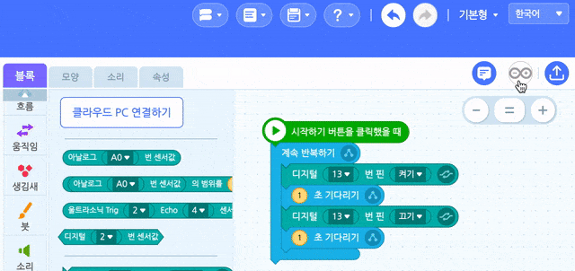

# 3.6 블록코딩을 텍스트 코딩으로 변환하기

엔트리 사용자라면 블록코드를 엔트리 파이썬 코드로 상호변환 해주는 기능이 있다는 것을 잘 알 것입니다. 이 목적은 소프트웨어 코딩교육이 블록코딩에서 머무르지 말고, 실전/실무에 사용하는 텍스트 코딩까지도 맛볼 수 있도록 배려하는 기능이라 할 수 있습니다. 우리가 사용하는 엔트리 커스텀 버전에도 유사한 기능이 있는데, 바로 **아두이노 블록코딩한 것을 C++ 텍스트 코딩으로 변환해 주는 기능입니다.**

본 기능은 하드웨어 제어 코드는 실무에서는 C/C++로 코딩하기 때문에 텍스트 코딩까지 더 심화로 공부하고자 하는 분들, 메이커 활동을 하는 누군가 인터넷에 공유한 C++ 코드를 아두이노에 적용시켜 보기 등 몇 가지 영역에 있어 매우 도움이 되는 유용한 기능이라 할 수 있습니다. 아래 코드변환 버튼을 눌러 내 블록코드가 텍스트 코드로는 어떻게 되는지 확인해 볼까요?

잠시 해당 C++코드를 이해해 보자. 여러분이 C++ 언어를 몰라 당장 이해하지 못한다 할지라도 크게 부담갖지는 마세요. 시간을 내서 드려다 보면 이해못 할 것이 세상에 없지 않다 생각합니다. 다만, 사람마다 걸리는 시간이 다를 뿐. 그러나, 앞 장에서 저자가 설명한 내용을 잘 따라왔다면 이해가 매우 어렵지도 않을 것으로 기대하는데 왜냐하면 지금 이 순간! 여러분이 텍스트 코드를 이해할 수 있게 하려는 의도성\(?\)을 가지고 설명을 해왔기 때문입니다.

코드 내용은 이것인데 13번 핀을 0v/5v의 출력\(OUTPUT\) 목적으로 사용하겠다고 알리고\(setup안에 pinMode 설정\), 이후 13번 디지털 핀에 디지털 값인 1\(HIGH, 5v\)과 0\(LOW, 0v\)를 1초\(1000ms\)간격 쉬면서\(delay\) 번갈아 쓰기를\(digitalWrite\) 무한반복\(loop\)하게 하는 코드입니다.

또 **변환된 C++언어 코드창은 일종의 코드 에디터\(Editor\)여서 직접 텍스트 코드를 수정해 볼 수도 있고, 업로드 하기 버튼을 눌러 수정한 내용을 아두이노로 코드 업로드 할 수 있습니다.**

